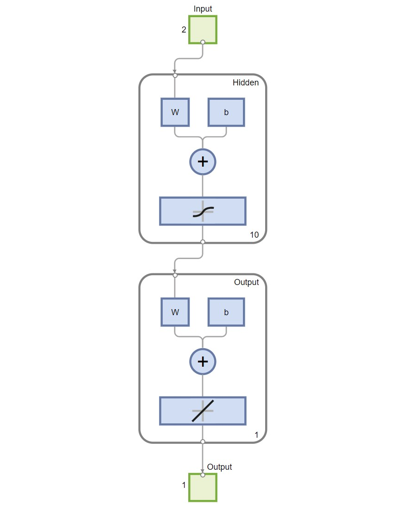
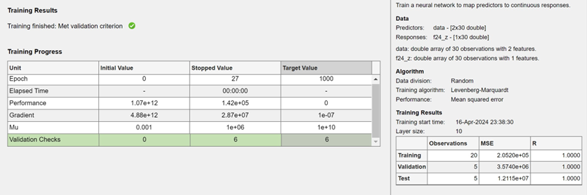
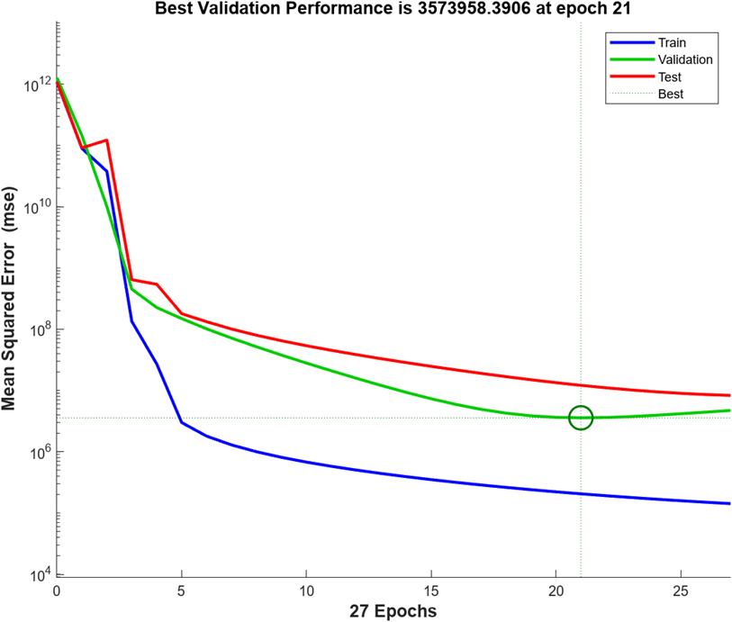
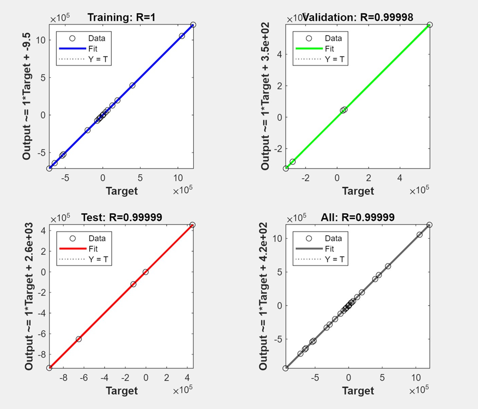
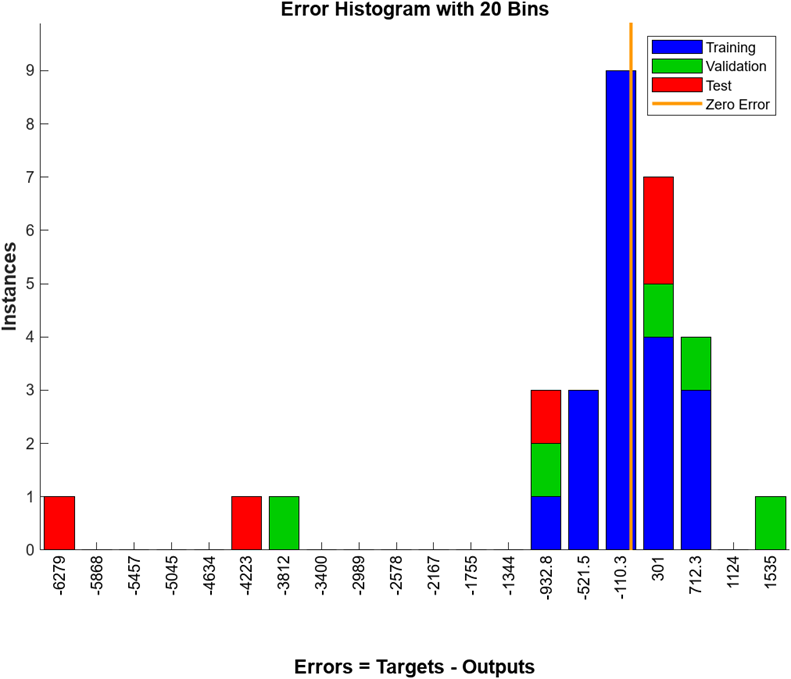

# HW 3, Supervised Learning: Neural Networks

## Overview

This project implements a neural network model using the Levenberg-Marquardt training method.

## Running Instructions

1. Open the part1.m script in MATLAB.

2. Ensure that x.csv, y.csv, and neuralNetworkFunction.m are in the same folder as the script.

3. Select 'Run' on the script in the toolbar.

4. View output in z-predicted.csv

## Parameters and Architecture

The neural network model consists of a two-layer feedforward network, with a hidden layer of 10 neurons and an output layer of 1. It utilizes the Levenberg-Marquardt training method with 70% of the data being used for training (20 data points), 15% for validation data (5 data points), and 15% for testing data (5 data points). The performance was measured using Mean Squared Error.

## Justification of Model Choice

This neural network model was chosen for its performance between training, validation, and testing along with its regression values. 

There is not a lot of data points that the network is able to train on, meaning that it would be incredibly difficult to obtain small mean squared error values for training, validation, and testing. If a performance metric was incredibly low and close to 0, but the validation and testing metrics were still incredibly high, this could signify overfitting so that was kept away from. The MSE for each progress point were very similar, and most importantly, on the performance graph, the testing and training were relatively similar.

The regressions were also all 1.0, or close to 1.0, meaning that they had high correlation with their values, expressed by the 45 degree angle of the lines on the regession.png plots. 

Error.png shows that a majority of the data was run close to zero errors without overfitting, which is ideal.

## Comparison with Other Learners

Compared to the other learners created during this process, this model had the best correlation values for all three parameters along with a better performance model without the danger of being overfitted. After analyzing over 100 different models, this proved to have the best overall metrics that prompted a belief for success. Additionally, when run with inputs, the model produced closer results to the predicted value compared to the other models and was not overfitted. The Levenberg-Marquardt training method was used over other training methods due to its success in training on nonlinear models, which was necessary for this data. 

## Model Complexity vs. Empirical Loss

This model was experimented on with other parameters to determine a right balance between model complexity and empirical loss. Multiple different hidden layer sizes were tested and it was found that as the neuron number increased, overfitting was more prone to happening. Having too small of a nueron size, however, prevented proper metrics to be achieved. Staying in the range of 7-12 neurons in the hidden layer proved to overall prevent overfitting and early stopping was also used to avoid training for too many epochs.

